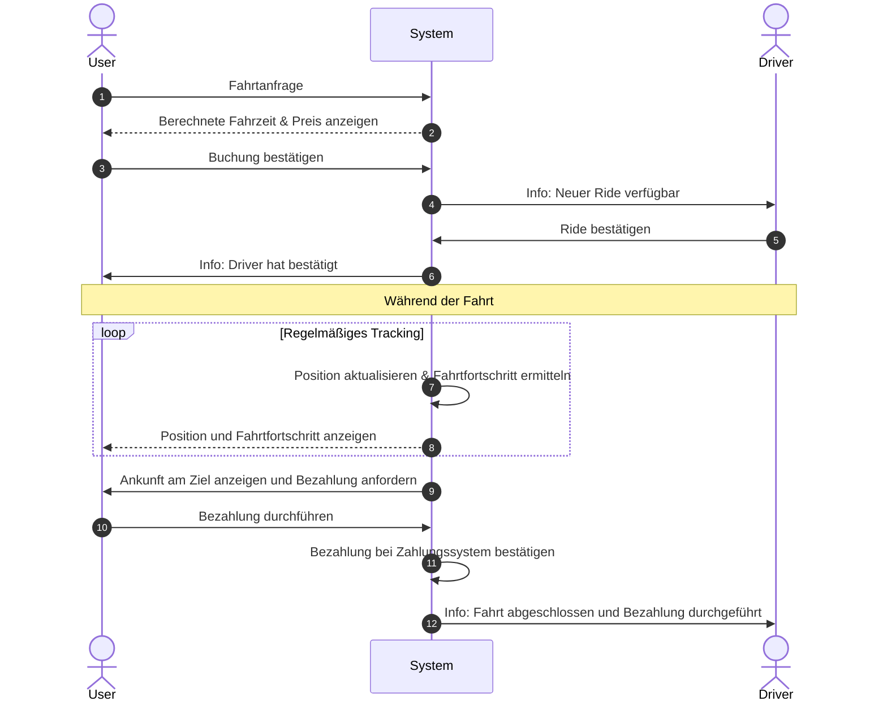
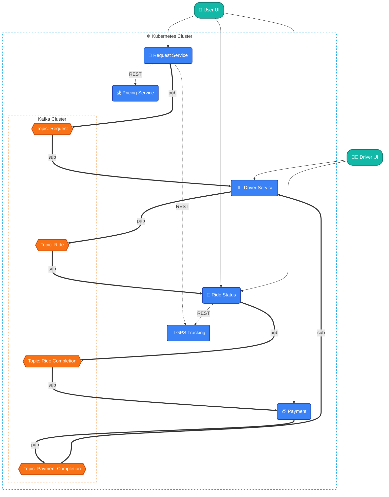

# CC-BD_Portfolio

Smart Mobility Plattform: Microservice-basiertes Ride-Sharing-System (Uber-Stil). Kernfeatures: SAGA-Transaktionen mit Compensation, synchrone/event-basierte Kommunikation. Orchestriert via Kubernetes inkl. Docker-Containerisierung, Zero-Downtime Updates und dedizierter Datenbank-Deployments.

## User stories

### User Story 1 & 2

> 1. Fahrt buchen
>
> > Der User will eine Fahrt von Start zu Ziel buchen. Es wird die berechnete Fahrzeit angezeigt. Außerdem wird ein Preis angezeigt. Der User bestätigt die Buchung. Wenn ein Driver die die Fahrt bestätigt, erhält der User diese Info. Während der Fahrt wird regelmäßig die Position aktualisiert um den Fahrtfortschritt zu ermitteln. Bei Ankunft am Ziel wird die Bezahlung durchgeführt.

> 2. Ein Driver bekommt die Benachrichtigung bis der User am Ziel angekommen ist
>
> > Ein Driver erhält eine Benachrichtigung, dass ein Ride verfügbar ist. Diesen kann der Driver bestätigen. Ist der User am Ziel angekommen erhält der Driver eine Benachrichtigung über den Abschluss der Fahrt. Während der Fahrt ist der Driver nicht für andere Fahrten buchbar, nach der Fahrt ist dieser wieder verfügbar.

Dieses Sequenzdiagramm stellt den Ablauf dieser beiden User stories dar:

### User Story 3

> 3. Analytics (Batch Processing)
>
> > Das System analysiert regelmäßig historische Daten (z.B. Fahrten der letzten 24h) in einem Batch-Job. Die Ergebnisse werden in einer NoSQL-Datenbank gespeichert und können von anderen Services (z.B. Pricing) abgefragt werden.

## Architektur

