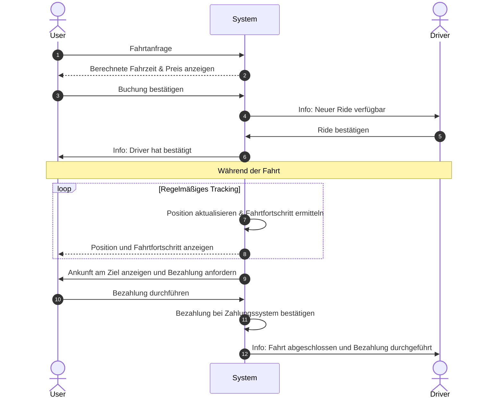
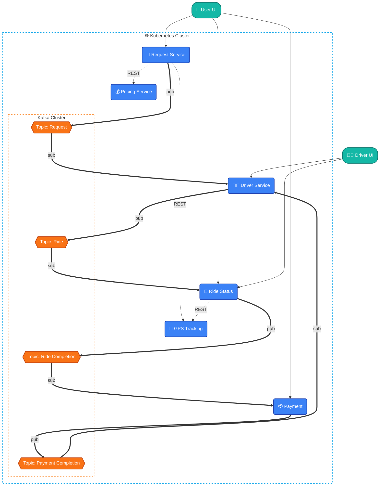

# CC-BD_Portfolio

Smart Mobility Plattform: Microservice-basiertes Ride-Sharing-System (Uber-Stil). Kernfeatures: SAGA-Transaktionen mit Compensation, synchrone/event-basierte Kommunikation. Orchestriert via Kubernetes inkl. Docker-Containerisierung, Zero-Downtime Updates und dedizierter Datenbank-Deployments.
GitHub Repo: https://github.com/simonh2507/CC-BD_Portfolio

## 1. User stories

### User Story 1 & 2

> 1. Fahrt buchen
>
> > Der User will eine Fahrt von Start zu Ziel buchen. Es wird die berechnete Fahrzeit angezeigt. Außerdem wird ein Preis angezeigt. Der User bestätigt die Buchung. Wenn ein Driver die Fahrt bestätigt, erhält der User diese Info. Während der Fahrt wird regelmäßig die Position aktualisiert um den Fahrtfortschritt zu ermitteln. Bei Ankunft am Ziel wird die Bezahlung durchgeführt.

> 2. Ein Driver bekommt die Benachrichtigung bis der User am Ziel angekommen ist
>
> > Ein Driver erhält eine Benachrichtigung, dass ein Ride verfügbar ist. Diesen kann der Driver bestätigen. Ist der User am Ziel angekommen erhält der Driver eine Benachrichtigung über den Abschluss der Fahrt. Während der Fahrt ist der Driver nicht für andere Fahrten buchbar, nach der Fahrt ist dieser wieder verfügbar.

Dieses Sequenzdiagramm stellt den Ablauf dieser beiden User stories dar:

```mermaid
sequenceDiagram
    autonumber
    actor User
    participant System
    actor Driver

    %% User Story 1
    User->>System: Fahrtanfrage
    System-->>User: Berechnete Fahrzeit & Preis anzeigen
    User->>System: Buchung bestätigen

    %% User Story 2
    System->>Driver: Info: Neuer Ride verfügbar
    Driver->>System: Ride bestätigen

    System->>User: Info: Driver hat bestätigt

    Note over User,Driver: Während der Fahrt
    loop Regelmäßiges Tracking
        System->>System: Position aktualisieren & Fahrtfortschritt ermitteln
        System-->>User: Position und Fahrtfortschritt anzeigen
    end

    System->>User: Ankunft am Ziel anzeigen und Bezahlung anfordern
    User->>System: Bezahlung durchführen
    System->>System: Bezahlung bei Zahlungssystem bestätigen
    System->>Driver: Info: Fahrt abgeschlossen und Bezahlung durchgeführt
```

### User Story 3

> 3. Analytics (Batch Processing)
>
> > Das System analysiert regelmäßig historische Daten (z.B. Fahrten der letzten 24h) in einem Batch-Job. Die Ergebnisse werden in einer NoSQL-Datenbank gespeichert und können von anderen Services (z.B. Pricing) abgefragt werden.

## 2. Architektur

> Die Plattform besteht aus spezialisierten Microservices, die über ein hybrides Kommunikationsmodell (Synchron/Asynchron) interagieren.

> Die Plattform besteht aus spezialisierten Microservices, die über ein hybrides Kommunikationsmodell (Synchron/Asynchron) interagieren.

```mermaid
flowchart TB
    classDef k8s fill:transparent,stroke:#0ea5e9,stroke-width:2px,stroke-dasharray: 5 5
    classDef kafkaCluster fill:transparent,stroke:#fb923c,stroke-width:2px,stroke-dasharray: 5 5
    classDef invisible fill:transparent,stroke:none,font-weight:bold

    classDef service fill:#3b82f6,stroke:#1e40af,stroke-width:2px,color:#fff,rx:5px,ry:5px
    classDef topic fill:#f97316,stroke:#c2410c,stroke-width:2px,color:#fff
    classDef actor fill:#14b8a6,stroke:#0f766e,stroke-width:2px,color:#fff,rx:20px,ry:20px

    User("👤 User UI"):::actor
    Driver("🧑‍✈️ Driver UI"):::actor

    subgraph K8s ["☸️ Kubernetes Cluster"]

        subgraph Services [" "]
            S_Req("📱 Request Service"):::service
            S_Price("💰 Pricing Service"):::service
            S_GPS("📍 GPS Tracking"):::service
            S_Driver("🧑‍✈️ Driver Service"):::service
            S_Ride("🚗 Ride Status"):::service
            S_Pay("💳 Payment"):::service
        end

        subgraph Kafka ["Kafka Cluster"]
            T_Req{{"Topic: Request"}}:::topic
            T_Ride{{"Topic: Ride"}}:::topic
            T_RideComp{{"Topic: Ride Completion"}}:::topic
            T_PayComp{{"Topic: Payment Completion"}}:::topic
        end
    end

    class K8s k8s
    class Kafka kafkaCluster
    class Services invisible

    User --> S_Req
    User --> S_Ride
    User --> S_Pay

    Driver --> S_Driver
    Driver --> S_Ride

    S_Req -.->|REST| S_GPS
    S_Req -.->|REST| S_Price
    S_Ride -.->|REST| S_GPS

    S_Req ===>|pub| T_Req
    T_Req ===>|sub| S_Driver

    S_Driver ===>|pub| T_Ride
    T_Ride ===>|sub| S_Ride

    S_Ride ===>|pub| T_RideComp
    T_RideComp ===>|sub| S_Pay

    S_Pay ===>|pub| T_PayComp
    T_PayComp ===>|sub| S_Driver
```
> Synchrone Kommunikation (REST): Der Request Service kommuniziert direkt mit dem GPS Tracking und Pricing Service, um dem User sofortige Preis- und Zeitschätzungen zu liefern.

> Asynchrone Kommunikation (Event-Streaming): Über Kafka werden kritische Events wie Topic: Request oder Topic: Payment Completion entkoppelt verarbeitet. Dies erhöht die Fehlertoleranz und Skalierbarkeit des Gesamtsystems.

## 3. SAGA Transaktion & Fehlerbehandlung

Um die Datenkonsistenz über mehrere Services hinweg zu garantieren, implementiert das System eine SAGA Transaktion für den Ride-Prozess:

> Schritt: Ride Status meldet Fahrtabschluss an Kafka.
> Schritt: Payment Service konsumiert das Event und führt die Bezahlung aus.
> Schritt: Driver Service empfängt die Erfolgsmeldung und setzt den Fahrer wieder auf "verfügbar".

Compensating Transaction:
Schlägt die Bezahlung fehl (z.B. Konto nicht gedeckt), sendet der Payment Service ein Payment Failed Event. Der Driver Service reagiert darauf mit einer Kompensations-Logik, die den Status des Fahrers korrigiert und ggf. eine manuelle Prüfung einleitet, statt den Fahrer einfach freizugeben.

## 4. Kubernetes Deployment & Containerisierung

Das System ist vollständig für den Betrieb in einem Kubernetes-Cluster orchestriert.

* **Cluster Status:** [Screenshot Kubectl Output](./assets/images/k8s_status.png)
    * Zeigt alle Deployments, Services und Pods im Namespace `ride-sharing`.
* **Containerisierung:** Beispielhaftes Dockerfile (Best Practices): [Request Service Dockerfile](./services/request-service/Dockerfile)
* **Datenbank-Deployment:** Die MongoDB läuft als eigenständiges Deployment innerhalb des Clusters: [MongoDB Manifest](./k8s/mongodb-deployment.yaml)

## 5. Zero-Downtime Update

Wir garantieren eine 100%ige Verfügbarkeit während Software-Updates durch den Einsatz von **Rolling Updates**.

* **Video-Demo:** [Screen Recording: Zero-Downtime Update](./assets/video/zero_downtime.mp4)
* **Erklärung:** Das Video zeigt, wie der `gps-service` aktualisiert wird, während ein Client-Script kontinuierlich Anfragen sendet. Dank der Kubernetes-Orchestrierung gibt es keine Verbindungsabbrüche (Zero Downtime).

## 6. Big Data Analytics (Batch Processing)

Ein periodischer Spark-Batch-Job analysiert historische Fahrtdaten, um geschäftskritische Kennzahlen zu berechnen.

* **Quellcode:** [PySpark Analytics Job](./assets/spark/main.py)
* **Datenquelle:** Historische Zahlungsdaten aus der MongoDB Collection `payments`.
* **Berechnungs-Logik (Spark):**
    
* **Execution Logs:**
    
* **NoSQL Ergebnisse:** Die Ergebnisse werden in die Collection `analytics_results` zurückgeschrieben und stehen dort für Services wie den `Pricing Service` zur Verfügung:
    

## 7. Noteworthy (Besonderheiten)

Aufgrund der begrenzten Hardware-Ressourcen im Ziel-Cluster wurde die MongoDB als zustandsloses Deployment konfiguriert. Dies erforderte eine besonders robuste Implementierung des Spark-Connectors (via Spark Connect) und eine effiziente Steuerung der Port-Forward-Verbindungen während der Analysephase.